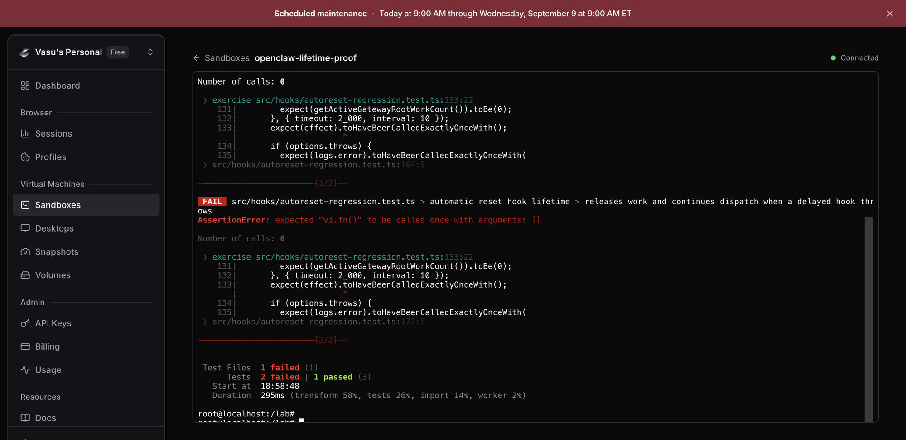
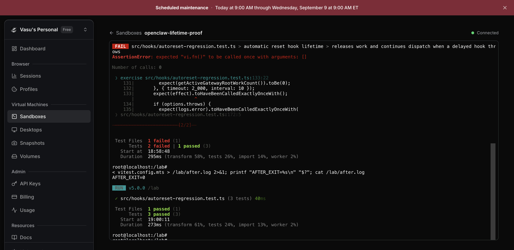

# Automatic reset hook lifetime: isolated Solari reproduction

This is a source-level regression through OpenClaw's real `emitSessionAutoResetHook`, not an OpenClaw UI, real memory-file write, model, or notification test.

## Result

- Unmodified main `948e897faeaaf3d4ee700a3e0b382c2a474589af`: **2 failed, 1 passed**. Once the originating async scope drains, delayed tracked hook effects do not execute.
- Proposed helper from [#144801](https://github.com/openclaw/openclaw/pull/144801), head `6f6370415df781bc784380706969c076e81d22c4`, plus the automatic-reset caller migration: **3 passed**.
- After independent review corrected the fixture callback's Promise return and repository formatting: **3 passed** again; see `final.log`. Screenshots show the earlier before/after runs, not the final formatting rerun.

## Method and limits

A deterministic barrier holds a registered hook until the triggering AsyncWorkScope has drained. The handler then calls the real `trackAsyncWork`. Assertions cover delayed success, no-parent success, thrown-handler logging, continued dispatch, and zero remaining Gateway roots.

The emitter, internal hook registry, Gateway admission owner, async scope, deferred helpers and abort-signal owner are real public source. Environment discovery, logging, diagnostic formatting and legacy-plugin inventory are mocked; effect is synthetic. This is a focused source fixture, **not the full repository build or typecheck**. No A2A authority claim or exactly-once-across-restart claim is made.

Solari disposable VM, Node 24.21.0, Vitest 5.0.0, oxfmt 0.66.0. Tests ran under `unshare -n env -i` with a clean HOME and no credentials. Tool installation preceded source execution. Input file hashes and pins are in `inputs.json`.

Command inside isolated source fixture:

```sh
unshare -n env -i PATH=/tooling/node-v24.21.0-linux-x64/bin:/usr/bin:/bin HOME=/tmp/lab-home node /tooling/node_modules/vitest/vitest.mjs run --config vitest.config.mts
```

The narrow caller change replaces `runWithGatewayIndependentRootWorkContinuation` with `runWithGatewayDetachedWorkContinuation` in `src/hooks/session-auto-reset.ts`, consuming the proposed shared owner. The dependency must land or be selected by its owners first. Full repository checks remain pending.

## Before



## After


